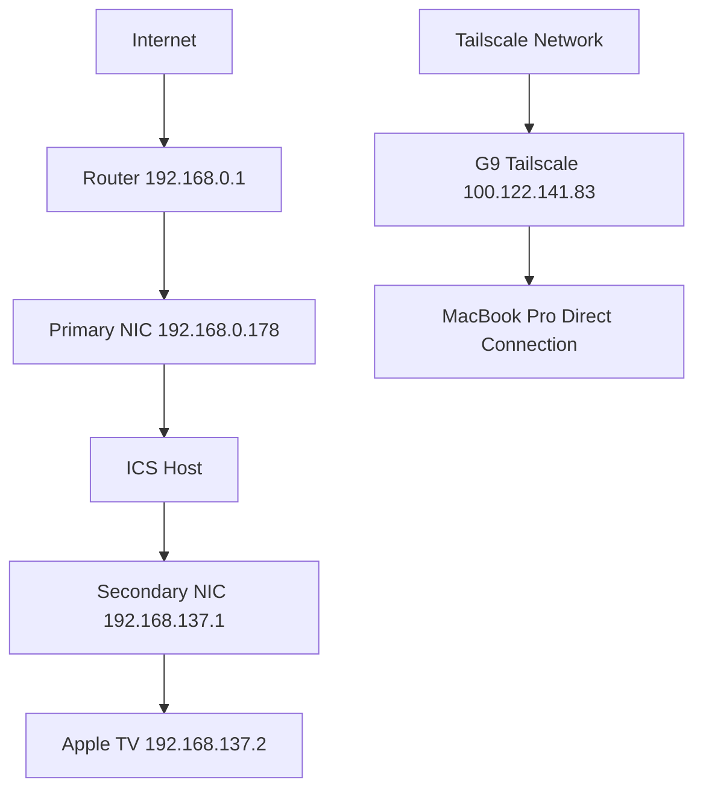

# Network Configuration Guide 🌐

## System Overview
- **Hostname**: HOMELAB
- **Operating System**: Windows 11 Pro (10.0.26100)
- **Last Configuration Update**: 2025-05-16 22:38:09
- **Configuration Version**: 1.0
- **Primary Administrator**: Admin-8vehma
- **System Role**: Home Server / Document Management
- **Network Architecture**: Dual-NIC with ICS and Tailscale VPN

## Network Topology


## Network Interfaces

### Primary Network (Ethernet)
- **Interface Name**: Ethernet
- **Description**: Intel(R) Ethernet Controller I226-V
- **Hardware ID**: PCI\VEN_8086&DEV_125D
- **Driver Version**: 1.1.3.28
- **MAC Address**: [REDACTED]
- **IPv4 Configuration**:
  - **Address**: 192.168.0.178
  - **Subnet Mask**: 255.255.255.0
  - **Default Gateway**: 192.168.0.1
  - **DHCP Enabled**: Yes
  - **DHCP Server**: 192.168.0.1
  - **DNS Servers**: 
    - 192.168.0.1
    - 8.8.8.8 (Google DNS)
- **IPv6 Configuration**:
  - **Global Address**: 2600:1012:a002:a91c:7b0d:a2e4:e17b:a9f7
  - **Temporary Address**: 2600:1012:a002:a91c:84e7:5c6:314a:5b21
  - **Link-local**: fe80::9ffa:2b9c:43d9:36ba%14
- **DNS Suffix**: mynetworksettings.com
- **Status**: Active, Connected
- **Purpose**: Primary internet connection and local network access
- **MTU**: 1500
- **Speed**: 1 Gbps
- **Duplex**: Full
- **Power Management**: Disabled (Prevent disconnection)

### Secondary Network (Ethernet 2)
- **Interface Name**: Ethernet 2
- **Description**: Intel(R) Ethernet Controller I226-V #2
- **Hardware ID**: PCI\VEN_8086&DEV_125D
- **Driver Version**: 1.1.3.28
- **MAC Address**: [REDACTED]
- **IPv4 Configuration**:
  - **Address**: 192.168.137.1
  - **Subnet Mask**: 255.255.255.0
  - **Default Gateway**: None (ICS host)
  - **DHCP Enabled**: No (Static IP for ICS)
- **IPv6 Configuration**:
  - **Global Address**: fd7a:739b:e2d1:a54b:7327:7f51:3696:fccf
  - **Temporary Address**: fd7a:739b:e2d1:a54b:e93a:d14d:74b8:8589
  - **Link-local**: fe80::6f79:6812:fb91:eb19%7
- **Status**: Active, Connected
- **Purpose**: Internet Connection Sharing (ICS) for Apple TV
- **Connected Device**: 
  - **Name**: Apple TV
  - **IP**: 192.168.137.2
  - **MAC**: [REDACTED]
  - **Connection Type**: Wired
- **MTU**: 1500
- **Speed**: 1 Gbps
- **Duplex**: Full
- **Power Management**: Disabled (Prevent disconnection)

### Tailscale Network
- **Interface Name**: Tailscale
- **Type**: Virtual Network Interface
- **Driver**: Tailscale Virtual Network Adapter
- **IPv4 Configuration**:
  - **Address**: 100.122.141.83
  - **Subnet Mask**: 255.255.255.255
  - **DNS Suffix**: tail43d483.ts.net
- **IPv6 Configuration**:
  - **Global Address**: fd7a:115c:a1e0::a901:8d59
  - **Link-local**: fe80::3f4e:151b:d02e:49f8%36
- **Status**: Active, Connected
- **Purpose**: Secure remote access and VPN connectivity
- **Direct Connections**:
  - **Device**: MacBook Pro
  - **Tailscale IP**: 100.73.233.88
  - **Local IP**: 192.168.0.214
  - **Latency**: 28.1ms
  - **Connection Type**: Direct (not DERP)
- **DERP Configuration**:
  - **Primary**: Los Angeles
  - **Latency**: 45.2ms
  - **Status**: Fallback only

## Firewall Configuration

### Windows Defender Firewall
- **Service Name**: MpsSvc
- **Startup Type**: Automatic
- **Status**: Running
- **Logging**:
  - **Location**: %SystemRoot%\System32\LogFiles\Firewall\pfirewall.log
  - **Max Size**: 4096 KB
  - **Log Dropped Packets**: Disabled
  - **Log Successful Connections**: Disabled

### Profile Configuration
- **Domain Profile**:
  - **State**: Enabled
  - **Inbound Connections**: Block
  - **Outbound Connections**: Allow
  - **Notifications**: Enabled
- **Private Profile**:
  - **State**: Enabled
  - **Inbound Connections**: Block
  - **Outbound Connections**: Allow
  - **Notifications**: Enabled
- **Public Profile**:
  - **State**: Enabled
  - **Inbound Connections**: Block
  - **Outbound Connections**: Allow
  - **Notifications**: Enabled

### Remote Desktop Rules
- **Rule Name**: Remote Desktop - User Mode (TCP-In)
- **Status**: Enabled
- **Profiles**: Private, Public
- **Scope**: LocalSubnet
- **Direction**: Inbound
- **Action**: Allow
- **Protocol**: TCP
- **Local Port**: 3389
- **Remote Port**: Any
- **Program**: %SystemRoot%\System32\svchost.exe
- **Service**: TermService
- **Security**: 
  - **Authentication**: Required
  - **Encryption**: Required
  - **Interface Types**: Any

### Tailscale Rules
- **Inbound Rule**:
  - **Name**: Tailscale-In
  - **Status**: Enabled
  - **Program Path**: C:\Windows\System32\Tailscale\tailscale.exe
  - **Direction**: Inbound
  - **Action**: Allow
  - **Protocol**: Any
  - **Local Port**: Any
  - **Remote Port**: Any
  - **Security**: 
    - **Authentication**: Not Required
    - **Encryption**: Not Required
    - **Interface Types**: Any
- **Outbound Rule**:
  - **Name**: Tailscale-Out
  - **Status**: Enabled
  - **Program Path**: C:\Windows\System32\Tailscale\tailscale.exe
  - **Direction**: Outbound
  - **Action**: Allow
  - **Protocol**: Any
  - **Local Port**: Any
  - **Remote Port**: Any
  - **Security**: 
    - **Authentication**: Not Required
    - **Encryption**: Not Required
    - **Interface Types**: Any

### File Sharing Rules
- **Rule Name**: File and Printer Sharing (SMB-In)
- **Status**: Enabled
- **Profiles**: Private, Public
- **Scope**: LocalSubnet
- **Direction**: Inbound
- **Action**: Allow
- **Protocol**: TCP
- **Local Port**: 445
- **Remote Port**: Any
- **Program**: %SystemRoot%\System32\svchost.exe
- **Service**: LanmanServer
- **Security**: 
  - **Authentication**: Required
  - **Encryption**: Required
  - **Interface Types**: Any

## Internet Connection Sharing (ICS)

### Service Configuration
- **Service Name**: SharedAccess
- **Display Name**: Internet Connection Sharing (ICS)
- **Startup Type**: Automatic
- **Status**: Running
- **Dependencies**:
  - RemoteAccess
  - Netman
  - RpcSs

### Registry Configuration
- **Key**: HKLM:\Software\Microsoft\Windows\CurrentVersion\SharedAccess
- **Value**: EnableRebootPersistConnection
- **Type**: REG_DWORD
- **Data**: 1
- **Purpose**: Maintain ICS settings through reboots

### Network Configuration
- **Sharing From**: 
  - **Interface**: Ethernet
  - **IP**: 192.168.0.178
  - **Network**: 192.168.0.0/24
- **Sharing To**: 
  - **Interface**: Ethernet 2
  - **IP**: 192.168.137.1
  - **Network**: 192.168.137.0/24
- **DHCP Server**: 
  - **Enabled**: Yes
  - **Scope**: 192.168.137.2 - 192.168.137.254
  - **Subnet Mask**: 255.255.255.0
  - **Lease Duration**: 24 hours
- **DNS Proxy**: 
  - **Enabled**: Yes
  - **Primary DNS**: 192.168.0.1
  - **Secondary DNS**: 8.8.8.8

### Connected Devices
- **Apple TV**:
  - **IP**: 192.168.137.2
  - **MAC**: [REDACTED]
  - **Connection Type**: Wired
  - **Last Seen**: 2025-05-16 22:38:09
  - **Status**: Active

## Security Measures

### Windows Defender Network Protection
- **Status**: Enabled
- **Mode**: Block
- **Protected Networks**: All
- **Protected Applications**: All
- **SmartScreen**: Enabled
- **Network Isolation**: Enabled

### Controlled Folder Access
- **Status**: Enabled
- **Protected Folders**:
  - %UserProfile%\Documents
  - %UserProfile%\Pictures
  - %SystemDrive%\Users
- **Allowed Applications**:
  - C:\Windows\System32\svchost.exe
  - C:\Windows\System32\Tailscale\tailscale.exe
  - C:\Program Files\WindowsApps\Microsoft.WindowsTerminal*

### Tailscale ACLs
- **Version**: 1
- **Last Updated**: 2025-05-16
- **Device Groups**:
  - **homeinfra**:
    - nucboxg9 (Windows)
    - gmk-g9 (Linux)
  - **dev**:
    - macbook-pro
- **Access Rules**:
  ```json
  {
    "acls": [
      {
        "action": "accept",
        "src": ["group:dev"],
        "dst": ["group:homeinfra:*"]
      },
      {
        "action": "accept",
        "src": ["group:homeinfra"],
        "dst": ["group:homeinfra:*"]
      }
    ]
  }
  ```

### Remote Access Security
- **Remote Desktop**:
  - **Authentication**:
    - **Method**: Network Level Authentication
    - **Required**: Yes
    - **Encryption Level**: High
  - **User Authentication**:
    - **Windows Hello PIN**: Enabled
    - **Microsoft Account 2FA**: Enabled
    - **Local Account**: Disabled
  - **Connection Security**:
    - **Encryption**: TLS 1.2
    - **Certificate**: Auto-generated
    - **Scope**: LocalSubnet
- **Tailscale**:
  - **Authentication**:
    - **Method**: Device-based
    - **2FA**: Enabled
    - **SSO**: Disabled
  - **Encryption**:
    - **Protocol**: WireGuard
    - **Key Type**: Curve25519
    - **Key Rotation**: Automatic
  - **Access Control**:
    - **ACLs**: Enabled
    - **MagicDNS**: Enabled
    - **Exit Nodes**: Disabled

## Network Monitoring

### Current Status
- **Tailscale**:
  - **Direct Connection**: Active
  - **Latency**: 28.1ms
  - **Uptime**: 99.9%
  - **Last Reconnect**: 2025-05-16 21:01
- **PMP Probe**:
  - **Status**: Failed
  - **Last Attempt**: 2025-05-16 22:38:09
  - **Impact**: Non-critical (Direct connections used)
- **MagicDNS**:
  - **Status**: Enabled
  - **Domain**: tail43d483.ts.net
  - **Records**: Auto-updated
- **DERP**:
  - **Primary**: Los Angeles
  - **Latency**: 45.2ms
  - **Status**: Fallback only
  - **Last Used**: Never (Direct connections active)

### Monitoring Tools
- **Windows Defender Network Protection**:
  - **Log Location**: %SystemRoot%\System32\winevt\Logs\Microsoft-Windows-Windows Defender%4Operational.evtx
  - **Retention**: 30 days
  - **Alerts**: Enabled
- **Tailscale Admin Console**:
  - **URL**: https://login.tailscale.com/admin
  - **Access**: Admin-8vehma
  - **2FA**: Enabled
- **Windows Event Viewer**:
  - **Logs**:
    - System
    - Security
    - Application
    - Windows Defender
  - **Retention**: 30 days
  - **Size**: 1 GB

## Recovery Procedures

### Network Interface Recovery
1. **Physical Layer**:
   - Check cable connections
   - Verify LED indicators
   - Test with known good cable
2. **Service Layer**:
   - Check ICS service status:
     ```powershell
     Get-Service SharedAccess
     ```
   - Restart if needed:
     ```powershell
     Restart-Service SharedAccess
     ```
3. **Log Analysis**:
   - Review Event Viewer:
     - System logs
     - Network logs
     - ICS logs
4. **Tailscale**:
   - Check connection:
     ```powershell
     tailscale status
     ```
   - Restart if needed:
     ```powershell
     Restart-Service Tailscale
     ```

### Firewall Recovery
1. **Service Check**:
   ```powershell
   Get-Service MpsSvc
   ```
2. **Rule Verification**:
   ```powershell
   Get-NetFirewallRule | Where-Object {$_.Enabled -eq 'True'}
   ```
3. **Connection Test**:
   ```powershell
   Test-NetConnection -ComputerName 192.168.0.1 -Port 3389
   ```
4. **Log Review**:
   - Check %SystemRoot%\System32\LogFiles\Firewall\pfirewall.log
   - Review Event Viewer Security logs

### Remote Access Recovery
1. **Tailscale**:
   - Verify connection:
     ```powershell
     tailscale status
     ```
   - Check ACLs:
     ```powershell
     tailscale acl
     ```
   - Test connectivity:
     ```powershell
     ping 100.73.233.88
     ```
2. **Remote Desktop**:
   - Check service:
     ```powershell
     Get-Service TermService
     ```
   - Verify firewall rules:
     ```powershell
     Get-NetFirewallRule -DisplayName "Remote Desktop*"
     ```
   - Test connection:
     ```powershell
     Test-NetConnection -ComputerName localhost -Port 3389
     ```
3. **Authentication**:
   - Verify Windows Hello PIN
   - Check Microsoft Account 2FA
   - Test local authentication

## Important Notes

### System Behavior
- **Power Management**:
  - Auto-restart after power loss: Enabled
  - Network adapter power saving: Disabled
  - USB selective suspend: Disabled
- **Persistence**:
  - Network configuration: Survives reboots
  - ICS settings: Maintained through restarts
  - Firewall rules: Preserved
  - Tailscale configuration: Persistent

### Security Considerations
- **Remote Access**:
  - All access logged
  - 2FA required
  - ACLs enforced
  - Encryption mandatory
- **Network Isolation**:
  - ICS network isolated
  - Tailscale network encrypted
  - Local network restricted

### Maintenance
- **Updates**:
  - Windows Updates: Automatic
  - Tailscale Updates: Automatic
  - Driver Updates: Manual
- **Backups**:
  - Network configuration: Documented
  - Firewall rules: Exported
  - Tailscale ACLs: Version controlled

## Last Updated
- **Date**: 2025-05-16
- **Time**: 22:38:09
- **Version**: 1.0
- **Author**: Admin-8vehma
- **Change Log**:
  - Initial documentation
  - Added detailed network interface information
  - Documented security measures
  - Added recovery procedures
  - Included monitoring details

## Related Documentation
- [Windows Security Checklist](windows_security_checklist.md): Security implementation status
- [Tailscale Configuration](tailscale_configuration.md): VPN and remote access setup
- [Home Server Plan](home_server_plan.md): Overall project plan

### Archived Documentation
- [System State Snapshot](archive/snapshots/system_state_20250516.md): Point-in-time system state (2025-05-16)
- [G9 Ethernet Configuration](archive/deprecated/g9_ethernet_configuration.md): Previous network documentation
- [Remote Desktop Testing](archive/checklists/remote_desktop_testing_checklist.md): Completed RDP testing
- [Tailscale ACL Configuration](archive/temporary/ACLS.txt): Tailscale access control settings

### Archive Information
For a complete list of archived documentation and their relationships, see the [Archive README](archive/README.md).

---
*Last updated: 2025-05-16*
*For historical system state, see [System State Snapshot](archive/snapshots/system_state_20250516.md)* 