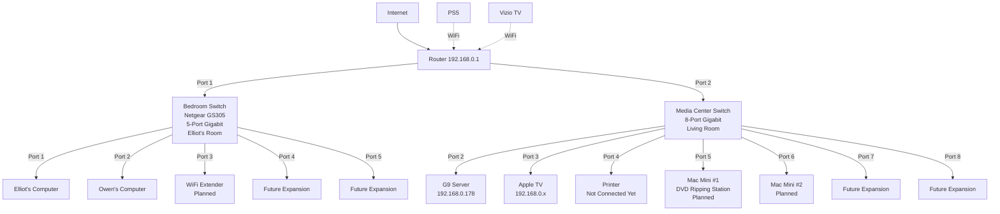

# Network Configuration Guide 🌐

## System Overview
- **Hostname**: HOMELAB
- **Operating System**: Windows 11 Pro (10.0.26100)
- **Last Configuration Update**: 2025-05-16 22:38:09
- **Configuration Version**: 1.0
- **Primary Administrator**: Admin-8vehma
- **System Role**: Home Server / Document Management
- **Network Architecture**: Dual-NIC with ICS and Tailscale VPN

## Network Topology


## Network Interfaces

### Primary Network (Ethernet)
- **Interface Name**: Ethernet
- **Description**: Intel(R) Ethernet Controller I226-V
- **Hardware ID**: PCI\VEN_8086&DEV_125D
- **Driver Version**: 1.1.3.28
- **MAC Address**: [REDACTED]
- **IPv4 Configuration**:
  - **Address**: 192.168.0.178
  - **Subnet Mask**: 255.255.255.0
  - **Default Gateway**: 192.168.0.1
  - **DHCP Enabled**: Yes
  - **DHCP Server**: 192.168.0.1
  - **DNS Servers**: 
    - 192.168.0.1
    - 8.8.8.8 (Google DNS)
- **IPv6 Configuration**:
  - **Global Address**: 2600:1012:a002:a91c:7b0d:a2e4:e17b:a9f7
  - **Temporary Address**: 2600:1012:a002:a91c:84e7:5c6:314a:5b21
  - **Link-local**: fe80::9ffa:2b9c:43d9:36ba%14
- **DNS Suffix**: mynetworksettings.com
- **Status**: Active, Connected
- **Purpose**: Primary internet connection and local network access
- **MTU**: 1500
- **Speed**: 1 Gbps
- **Duplex**: Full
- **Power Management**: Disabled (Prevent disconnection)

### Secondary Network (Ethernet 2)
- **Interface Name**: Ethernet 2
- **Description**: Intel(R) Ethernet Controller I226-V #2
- **Hardware ID**: PCI\VEN_8086&DEV_125D
- **Driver Version**: 1.1.3.28
- **MAC Address**: [REDACTED]
- **IPv4 Configuration**:
  - **Address**: 192.168.137.1
  - **Subnet Mask**: 255.255.255.0
  - **Default Gateway**: None (ICS host)
  - **DHCP Enabled**: No (Static IP for ICS)
- **IPv6 Configuration**:
  - **Global Address**: fd7a:739b:e2d1:a54b:7327:7f51:3696:fccf
  - **Temporary Address**: fd7a:739b:e2d1:a54b:e93a:d14d:74b8:8589
  - **Link-local**: fe80::6f79:6812:fb91:eb19%7
- **Status**: Active, Connected
- **Purpose**: Internet Connection Sharing (ICS) for Apple TV
- **Connected Device**: 
  - **Name**: Apple TV
  - **IP**: 192.168.137.2
  - **MAC**: [REDACTED]
  - **Connection Type**: Wired
- **MTU**: 1500
- **Speed**: 1 Gbps
- **Duplex**: Full
- **Power Management**: Disabled (Prevent disconnection)

### Tailscale Network
- **Interface Name**: Tailscale
- **Type**: Virtual Network Interface
- **Driver**: Tailscale Virtual Network Adapter
- **IPv4 Configuration**:
  - **Address**: 100.122.141.83
  - **Subnet Mask**: 255.255.255.255
  - **DNS Suffix**: tail43d483.ts.net
- **IPv6 Configuration**:
  - **Global Address**: fd7a:115c:a1e0::a901:8d59
  - **Link-local**: fe80::3f4e:151b:d02e:49f8%36
- **Status**: Active, Connected
- **Purpose**: Secure remote access and VPN connectivity
- **Direct Connections**:
  - **Device**: MacBook Pro
  - **Tailscale IP**: 100.73.233.88
  - **Local IP**: 192.168.0.214
  - **Latency**: 28.1ms
  - **Connection Type**: Direct (not DERP)
- **DERP Configuration**:
  - **Primary**: Los Angeles
  - **Latency**: 45.2ms
  - **Status**: Fallback only

## Media Center Network Configuration

### Switch Details
- **Model**: Unmanaged 8-Port Gigabit Switch
- **Location**: Living Room/Media Center
- **Purchase Date**: 2025-05-19
- **Price**: $25-30 USD
- **Features**:
  - 8 Gigabit Ethernet ports
  - Auto-negotiation
  - Auto MDI/MDI-X
  - Non-blocking switching
  - Plug-and-play operation

### Connected Devices
- **G9 Server** (Port 2):
  - **IP**: 192.168.0.178
  - **Connection Type**: Wired
  - **Speed**: 1 Gbps
  - **Status**: Active
- **Apple TV** (Port 3):
  - **IP**: 192.168.137.2
  - **Connection Type**: Wired
  - **Speed**: 1 Gbps
  - **Status**: Active
- **Printer** (Port 4):
  - **Status**: Not Connected Yet
  - **Connection Type**: Wired (Planned)
  - **Speed**: 1 Gbps
- **Mac Mini #1** (Port 5):
  - **Status**: Planned
  - **Purpose**: DVD Ripping Station
  - **Connection Type**: Wired
  - **Speed**: 1 Gbps
- **Mac Mini #2** (Port 6):
  - **Status**: Planned
  - **Connection Type**: Wired
  - **Speed**: 1 Gbps
- **Ports 7-8**: Reserved for future expansion

### Bedroom Network Configuration
- **Switch Model**: Netgear GS305
- **Type**: 5-Port Unmanaged Gigabit Switch
- **Location**: Elliot's Bedroom
- **Connection**: Direct connection to Router Port 1
- **Connected Devices**:
  - **Elliot's Computer** (Port 1):
    - **Connection Type**: Wired
    - **Speed**: 1 Gbps
    - **Status**: Active
    - **Cable**: ~15ft CAT7 flat
  - **Owen's Computer** (Port 2):
    - **Connection Type**: Wired
    - **Speed**: 1 Gbps
    - **Status**: Active
    - **Cable**: 50ft flat (26AWG OFC+PVC)
  - **WiFi Extender** (Port 3):
    - **Model**: TP-Link AC1200
    - **Status**: Planned
  - **Ports 4-5**: Reserved for future expansion

### Wireless Devices
- **PS5**:
  - **Connection Type**: WiFi
  - **Status**: Active
  - **Performance**: Satisfactory
- **Vizio TV**:
  - **Connection Type**: WiFi
  - **Status**: Active
  - **Note**: No built-in network port, USB adapter available but not purchased

### Network Configuration
- **Switch Type**: Unmanaged
- **Network**: 192.168.0.0/24
- **Uplink**: Single cable to router
- **Port Status**: 
  - Ports 1-3: Active
  - Ports 4-8: Available
- **Power**: AC adapter
- **Location**: Media center cabinet

### Benefits
- Centralized network access for all media devices
- Reliable wired connections for critical devices
- Future-proof with available ports for expansion
- Simplified cable management
- Improved network performance for media streaming

### Future Considerations
- Monitor network performance
- Consider 2.5G upgrade if needed
- Document any new devices added
- Regular maintenance checks
- Evaluate Nintendo Switch network adapter if needed
- Plan for Mac Mini DVD ripping station setup

### Physical Network Layout

#### Cable Configuration (Rental Property Constraints)
- **Note**: All long cable runs use flat cables due to rental property constraints
  - Required for baseboard routing and corner management
  - Chosen for aesthetic considerations and installation flexibility
  - Temporary solution until permanent installation is possible

#### Cable Runs
- **Router to Bedroom Switch**:
  - **Total Length**: 150ft (100ft + 50ft coupled)
  - **Type**: Flat cables
  - **Specifications**:
    - 2000Mhz
    - 40Gigabit/s
    - Gold plated
    - SFTP (Shielded Foil Twisted Pair)
  - **Route**: Along baseboards
  - **Status**: Temporary installation (rental property)

- **Bedroom Switch Connections**:
  - **To Elliot's Computer**:
    - **Length**: ~15ft
    - **Type**: Flat cable
    - **Specifications**: CAT7
  - **To Owen's Computer**:
    - **Length**: 50ft
    - **Type**: Flat cable
    - **Specifications**:
      - Gauge: 26AWG
      - Material: OFC+PVC (Oxygen-Free Copper + PVC)
      - Width: 9.0mm

- **Media Center Switch Connections**:
  - **To G9 Server**:
    - **Length**: 1ft
    - **Type**: Patch cable
    - **Specifications**:
      - Shielded SFTP
      - Heavy duty
      - Gold plated
  - **To Apple TV**:
    - **Length**: Short run
    - **Type**: Standard patch cable
    - **Status**: Direct connection to switch

#### Network Performance Monitoring

##### Current Performance Metrics
- **Baseline Measurements** (To be documented):
  - Router to Bedroom Switch:
    - Latency: [TODO: Measure]
    - Throughput: [TODO: Measure]
  - Bedroom Switch to Computers:
    - Latency: [TODO: Measure]
    - Throughput: [TODO: Measure]
  - Media Center Switch:
    - Port-to-port latency: [TODO: Measure]
    - Device throughput: [TODO: Measure]

##### Monitoring Plan
1. **Daily Checks**:
   - Basic connectivity tests
   - Latency measurements to key devices
   - Bandwidth usage patterns

2. **Weekly Tests**:
   - Full network throughput test
   - Device-to-device latency mapping
   - WiFi signal strength and quality

3. **Monthly Review**:
   - Performance trend analysis
   - Identify any degradation
   - Document any issues

##### Performance Thresholds
- **Acceptable Ranges**:
  - Latency: < 5ms (local network)
  - Throughput: > 800Mbps (wired)
  - Packet Loss: < 0.1%
  - WiFi Signal: > -65dBm

##### Monitoring Tools
- **Built-in Tools**:
  - Windows Network Diagnostics
  - Router Admin Interface
  - Tailscale Metrics
- **Additional Tools** (To be implemented):
  - Network speed testing
  - Latency monitoring
  - Bandwidth usage tracking

#### Future Considerations
- **Permanent Installation Planning**:
  - Document current cable routes for future reference
  - Plan for proper in-wall cable runs
  - Consider structured cabling system
  - Design for standard round cables
- **Current Setup Notes**:
  - Temporary solution for rental property
  - Flat cables used for practical installation
  - Performance monitoring in place
  - Ready for upgrade when moving to permanent location

#### Device Locations
- **Router**:
  - **Location**: Living Room Shelf
  - **Mounting**: Shelf-mounted
  - **Power**: Connected to primary outlet

- **Media Center Equipment** (Secretary Desk):
  - **Location**: Living Room
  - **Setup**: Open/well-ventilated
  - **Devices**:
    - G9 Server
    - 8-Port Switch
    - Mac Mini #1 (Planned)
    - Mac Mini #2 (Planned)
  - **Power**: Connected to primary outlet

- **Apple TV**:
  - **Location**: Master Bedroom (Mark and Devon's)
  - **Setup**: Dresser-mounted
  - **Adjacent Device**: Toshiba Amazon FireTV
  - **Power**: [TODO: Document power source]

#### Switch Locations
- **Media Center Switch (8-Port)**:
  - **Location**: Living Room Secretary Desk
  - **Mounting**: Desktop placement
  - **Power Source**: Primary outlet (shared with router and G9)
  - **Cable Management**: [TODO: Document cable routing details]

- **Bedroom Switch (5-Port)**:
  - **Model**: Netgear GS305
  - **Location**: Elliot's Bedroom
  - **Type**: Unmanaged Gigabit Switch
  - **Mounting**: [TODO: Add specific location in room]
  - **Power Source**: [TODO: Add power outlet location]
  - **Cable Management**: [TODO: Add cable routing details]

### Switch Specifications

#### Media Center Switch (8-Port)
- **Model**: Unmanaged Gigabit Switch
- **Type**: 8-Port
- **Speed**: 10/100/1000 Mbps
- **Features**:
  - Auto-negotiation
  - Auto MDI/MDI-X
  - Non-blocking switching
  - Plug-and-play operation
- **Power**: AC adapter
- **Status**: Active
- **Location**: Living Room Media Cabinet

#### Bedroom Switch (5-Port)
- **Model**: Netgear GS305
- **Type**: 5-Port Unmanaged Gigabit Switch
- **Speed**: 10/100/1000 Mbps
- **Features**:
  - Auto-negotiation
  - Auto MDI/MDI-X
  - Non-blocking switching
  - Plug-and-play operation
- **Power**: AC adapter
- **Status**: Active
- **Location**: Elliot's Bedroom

## Firewall Configuration

### Windows Defender Firewall
- **Service Name**: MpsSvc
- **Startup Type**: Automatic
- **Status**: Running
- **Logging**:
  - **Location**: %SystemRoot%\System32\LogFiles\Firewall\pfirewall.log
  - **Max Size**: 4096 KB
  - **Log Dropped Packets**: Disabled
  - **Log Successful Connections**: Disabled

### Profile Configuration
- **Domain Profile**:
  - **State**: Enabled
  - **Inbound Connections**: Block
  - **Outbound Connections**: Allow
  - **Notifications**: Enabled
- **Private Profile**:
  - **State**: Enabled
  - **Inbound Connections**: Block
  - **Outbound Connections**: Allow
  - **Notifications**: Enabled
- **Public Profile**:
  - **State**: Enabled
  - **Inbound Connections**: Block
  - **Outbound Connections**: Allow
  - **Notifications**: Enabled

### Remote Desktop Rules
- **Rule Name**: Remote Desktop - User Mode (TCP-In)
- **Status**: Enabled
- **Profiles**: Private, Public
- **Scope**: LocalSubnet
- **Direction**: Inbound
- **Action**: Allow
- **Protocol**: TCP
- **Local Port**: 3389
- **Remote Port**: Any
- **Program**: %SystemRoot%\System32\svchost.exe
- **Service**: TermService
- **Security**: 
  - **Authentication**: Required
  - **Encryption**: Required
  - **Interface Types**: Any

### Tailscale Rules
- **Inbound Rule**:
  - **Name**: Tailscale-In
  - **Status**: Enabled
  - **Program Path**: C:\Windows\System32\Tailscale\tailscale.exe
  - **Direction**: Inbound
  - **Action**: Allow
  - **Protocol**: Any
  - **Local Port**: Any
  - **Remote Port**: Any
  - **Security**: 
    - **Authentication**: Not Required
    - **Encryption**: Not Required
    - **Interface Types**: Any
- **Outbound Rule**:
  - **Name**: Tailscale-Out
  - **Status**: Enabled
  - **Program Path**: C:\Windows\System32\Tailscale\tailscale.exe
  - **Direction**: Outbound
  - **Action**: Allow
  - **Protocol**: Any
  - **Local Port**: Any
  - **Remote Port**: Any
  - **Security**: 
    - **Authentication**: Not Required
    - **Encryption**: Not Required
    - **Interface Types**: Any

### File Sharing Rules
- **Rule Name**: File and Printer Sharing (SMB-In)
- **Status**: Enabled
- **Profiles**: Private, Public
- **Scope**: LocalSubnet
- **Direction**: Inbound
- **Action**: Allow
- **Protocol**: TCP
- **Local Port**: 445
- **Remote Port**: Any
- **Program**: %SystemRoot%\System32\svchost.exe
- **Service**: LanmanServer
- **Security**: 
  - **Authentication**: Required
  - **Encryption**: Required
  - **Interface Types**: Any

## Internet Connection Sharing (ICS)

### Service Configuration
- **Service Name**: SharedAccess
- **Display Name**: Internet Connection Sharing (ICS)
- **Startup Type**: Automatic
- **Status**: Running
- **Dependencies**:
  - RemoteAccess
  - Netman
  - RpcSs

### Registry Configuration
- **Key**: HKLM:\Software\Microsoft\Windows\CurrentVersion\SharedAccess
- **Value**: EnableRebootPersistConnection
- **Type**: REG_DWORD
- **Data**: 1
- **Purpose**: Maintain ICS settings through reboots

### Network Configuration
- **Sharing From**: 
  - **Interface**: Ethernet
  - **IP**: 192.168.0.178
  - **Network**: 192.168.0.0/24
- **Sharing To**: 
  - **Interface**: Ethernet 2
  - **IP**: 192.168.137.1
  - **Network**: 192.168.137.0/24
- **DHCP Server**: 
  - **Enabled**: Yes
  - **Scope**: 192.168.137.2 - 192.168.137.254
  - **Subnet Mask**: 255.255.255.0
  - **Lease Duration**: 24 hours
- **DNS Proxy**: 
  - **Enabled**: Yes
  - **Primary DNS**: 192.168.0.1
  - **Secondary DNS**: 8.8.8.8

### Connected Devices
- **Apple TV**:
  - **IP**: 192.168.137.2
  - **MAC**: [REDACTED]
  - **Connection Type**: Wired
  - **Last Seen**: 2025-05-16 22:38:09
  - **Status**: Active

## Security Measures

### Windows Defender Network Protection
- **Status**: Enabled
- **Mode**: Block
- **Protected Networks**: All
- **Protected Applications**: All
- **SmartScreen**: Enabled
- **Network Isolation**: Enabled

### Controlled Folder Access
- **Status**: Enabled
- **Protected Folders**:
  - %UserProfile%\Documents
  - %UserProfile%\Pictures
  - %SystemDrive%\Users
- **Allowed Applications**:
  - C:\Windows\System32\svchost.exe
  - C:\Windows\System32\Tailscale\tailscale.exe
  - C:\Program Files\WindowsApps\Microsoft.WindowsTerminal*

### Tailscale ACLs
- **Version**: 1
- **Last Updated**: 2025-05-16
- **Device Groups**:
  - **homeinfra**:
    - nucboxg9 (Windows)
    - gmk-g9 (Linux)
  - **dev**:
    - macbook-pro
- **Access Rules**:
  ```json
  {
    "acls": [
      {
        "action": "accept",
        "src": ["group:dev"],
        "dst": ["group:homeinfra:*"]
      },
      {
        "action": "accept",
        "src": ["group:homeinfra"],
        "dst": ["group:homeinfra:*"]
      }
    ]
  }
  ```

### Remote Access Security
- **Remote Desktop**:
  - **Authentication**:
    - **Method**: Network Level Authentication
    - **Required**: Yes
    - **Encryption Level**: High
  - **User Authentication**:
    - **Windows Hello PIN**: Enabled
    - **Microsoft Account 2FA**: Enabled
    - **Local Account**: Disabled
  - **Connection Security**:
    - **Encryption**: TLS 1.2
    - **Certificate**: Auto-generated
    - **Scope**: LocalSubnet
- **Tailscale**:
  - **Authentication**:
    - **Method**: Device-based
    - **2FA**: Enabled
    - **SSO**: Disabled
  - **Encryption**:
    - **Protocol**: WireGuard
    - **Key Type**: Curve25519
    - **Key Rotation**: Automatic
  - **Access Control**:
    - **ACLs**: Enabled
    - **MagicDNS**: Enabled
    - **Exit Nodes**: Disabled

## Network Monitoring

### Current Status
- **Tailscale**:
  - **Direct Connection**: Active
  - **Latency**: 28.1ms
  - **Uptime**: 99.9%
  - **Last Reconnect**: 2025-05-16 21:01
- **PMP Probe**:
  - **Status**: Failed
  - **Last Attempt**: 2025-05-16 22:38:09
  - **Impact**: Non-critical (Direct connections used)
- **MagicDNS**:
  - **Status**: Enabled
  - **Domain**: tail43d483.ts.net
  - **Records**: Auto-updated
- **DERP**:
  - **Primary**: Los Angeles
  - **Latency**: 45.2ms
  - **Status**: Fallback only
  - **Last Used**: Never (Direct connections active)

### Monitoring Tools
- **Windows Defender Network Protection**:
  - **Log Location**: %SystemRoot%\System32\winevt\Logs\Microsoft-Windows-Windows Defender%4Operational.evtx
  - **Retention**: 30 days
  - **Alerts**: Enabled

- **Tailscale Monitoring System**:
  - **Scheduled Task**: "TailscaleMonitoring"
    - Runs as SYSTEM
    - Executes every 5 minutes
    - Auto-restarts on failure
    - Runs at system startup
  - **Log Locations**:
    - Main Logs: `C:\Logs\Tailscale`
    - Metrics: `C:\Logs\Tailscale\Metrics`
    - Retention: 30 days
  - **Alert Configuration**:
    - Email: msakamoto+homelab@gmail.com
    - Latency Threshold: 100ms
    - Alert Conditions:
      - Connection loss
      - High latency (>100ms)
      - DERP fallback usage
      - Service interruptions
  - **Verification Tools**:
    - `scripts/check_monitoring_status.ps1`: System status check
    - `scripts/test_monitoring_new.ps1`: Test script
    - Task Scheduler: Manual verification
  - **Maintenance**:
    - Daily log review
    - Weekly metrics analysis
    - Monthly system verification
    - Quarterly configuration review

- **Tailscale Admin Console**:
  - **URL**: https://login.tailscale.com/admin
  - **Access**: Admin-8vehma
  - **2FA**: Enabled

- **Windows Event Viewer**:
  - **Logs**:
    - System
    - Security
    - Application
    - Windows Defender
  - **Retention**: 30 days
  - **Size**: 1 GB

## Recovery Procedures

### Network Interface Recovery
1. **Physical Layer**:
   - Check cable connections
   - Verify LED indicators
   - Test with known good cable
2. **Service Layer**:
   - Check ICS service status:
     ```powershell
     Get-Service SharedAccess
     ```
   - Restart if needed:
     ```powershell
     Restart-Service SharedAccess
     ```
3. **Log Analysis**:
   - Review Event Viewer:
     - System logs
     - Network logs
     - ICS logs
4. **Tailscale**:
   - Check connection:
     ```powershell
     tailscale status
     ```
   - Restart if needed:
     ```powershell
     Restart-Service Tailscale
     ```

### Firewall Recovery
1. **Service Check**:
   ```powershell
   Get-Service MpsSvc
   ```
2. **Rule Verification**:
   ```powershell
   Get-NetFirewallRule | Where-Object {$_.Enabled -eq 'True'}
   ```
3. **Connection Test**:
   ```powershell
   Test-NetConnection -ComputerName 192.168.0.1 -Port 3389
   ```
4. **Log Review**:
   - Check %SystemRoot%\System32\LogFiles\Firewall\pfirewall.log
   - Review Event Viewer Security logs

### Remote Access Recovery
1. **Tailscale**:
   - Verify connection:
     ```powershell
     tailscale status
     ```
   - Check ACLs:
     ```powershell
     tailscale acl
     ```
   - Test connectivity:
     ```powershell
     ping 100.73.233.88
     ```
2. **Remote Desktop**:
   - Check service:
     ```powershell
     Get-Service TermService
     ```
   - Verify firewall rules:
     ```powershell
     Get-NetFirewallRule -DisplayName "Remote Desktop*"
     ```
   - Test connection:
     ```powershell
     Test-NetConnection -ComputerName localhost -Port 3389
     ```
3. **Authentication**:
   - Verify Windows Hello PIN
   - Check Microsoft Account 2FA
   - Test local authentication

## Important Notes

### System Behavior
- **Power Management**:
  - Auto-restart after power loss: Enabled
  - Network adapter power saving: Disabled
  - USB selective suspend: Disabled
- **Persistence**:
  - Network configuration: Survives reboots
  - ICS settings: Maintained through restarts
  - Firewall rules: Preserved
  - Tailscale configuration: Persistent

### Security Considerations
- **Remote Access**:
  - All access logged
  - 2FA required
  - ACLs enforced
  - Encryption mandatory
- **Network Isolation**:
  - ICS network isolated
  - Tailscale network encrypted
  - Local network restricted

### Maintenance
- **Updates**:
  - Windows Updates: Automatic
  - Tailscale Updates: Automatic
  - Driver Updates: Manual
- **Backups**:
  - Network configuration: Documented
  - Firewall rules: Exported
  - Tailscale ACLs: Version controlled

## Last Updated
- **Date**: 2025-05-19
- **Time**: 23:45:00
- **Version**: 1.6
- **Author**: Admin-8vehma
- **Change Log**:
  - Corrected bedroom switch model to Netgear GS305 (5-port)
  - Added Elliot's computer cable specifications
  - Updated switch specifications section
  - Updated last modified date and version

## Related Documentation
- [Windows Security Checklist](windows_security_checklist.md): Security implementation status
- [Tailscale Configuration](tailscale_configuration.md): VPN and remote access setup
- [Home Server Plan](home_server_plan.md): Overall project plan

### Archived Documentation
- [System State Snapshot](archive/snapshots/system_state_20250516.md): Point-in-time system state (2025-05-16)
- [G9 Ethernet Configuration](archive/deprecated/g9_ethernet_configuration.md): Previous network documentation
- [Remote Desktop Testing](archive/checklists/remote_desktop_testing_checklist.md): Completed RDP testing
- [Tailscale ACL Configuration](archive/temporary/ACLS.txt): Tailscale access control settings

### Archive Information
For a complete list of archived documentation and their relationships, see the [Archive README](archive/README.md).

## Media Center Network Expansion (2025 Update)

The network expansion has been completed with the following setup:

### Current Configuration
- **Media Center Switch**:
  - 8-Port Unmanaged Gigabit Switch
  - Location: Living Room Secretary Desk
  - Connected Devices:
    - G9 Server (Port 2)
    - Apple TV (Port 3)
    - Printer (Port 4, planned)
    - Mac Mini #1 (Port 5, planned)
    - Mac Mini #2 (Port 6, planned)
    - Ports 7-8: Reserved for future expansion

- **Bedroom Network**:
  - Netgear GS305 5-Port Unmanaged Gigabit Switch
  - Location: Elliot's Bedroom
  - Connected Devices:
    - Elliot's Computer (Port 1)
    - Owen's Computer (Port 2)
    - WiFi Extender (Port 3, planned)
    - Ports 4-5: Reserved for future expansion

### Benefits Achieved
- Centralized network access for all media devices
- Reliable wired connections for critical devices
- Future-proof with available ports for expansion
- Simplified cable management
- Improved network performance for media streaming

### Future Considerations
- Monitor network performance
- Consider 2.5G upgrade if needed
- Document any new devices added
- Regular maintenance checks
- Evaluate Nintendo Switch network adapter if needed
- Plan for Mac Mini DVD ripping station setup
- Document UPS installation when completed

---
*Last updated: 2025-05-19*
*For historical system state, see [System State Snapshot](archive/snapshots/system_state_20250516.md)*

## TODO List
- [ ] Document UPS installation when completed
- [ ] Document Apple TV power source
- [ ] Document bedroom switch mounting location
- [ ] Document bedroom switch power source
- [ ] Document cable routing paths
- [ ] Document wall plate/jack locations
- [ ] Document WiFi extender planned location
- [ ] Document cable management details
- [ ] Measure and document network performance metrics
- [ ] Set up automated performance monitoring
- [ ] Create performance baseline documentation
- [ ] Document acceptable performance thresholds 